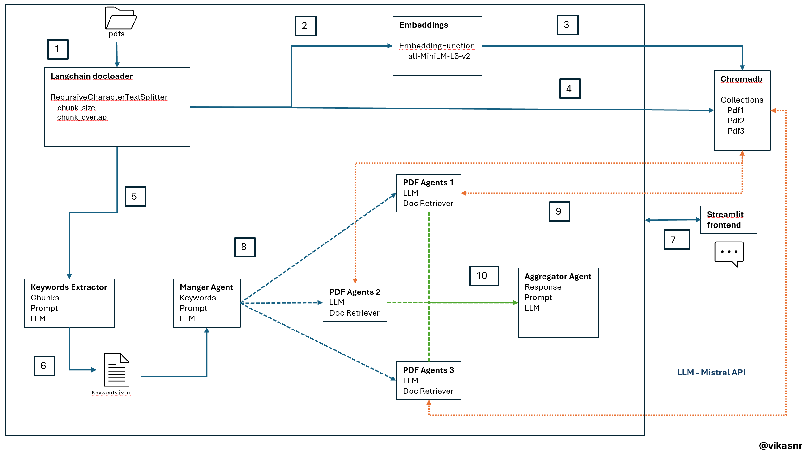
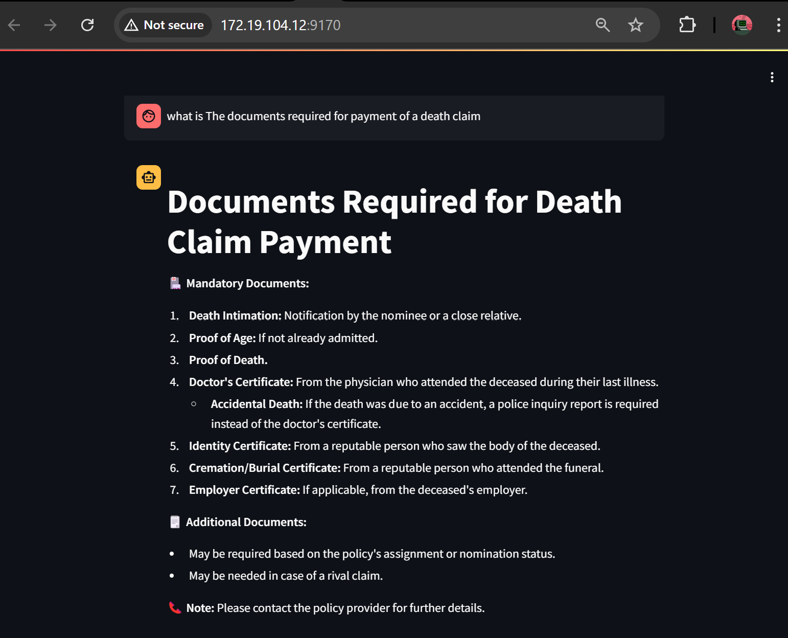
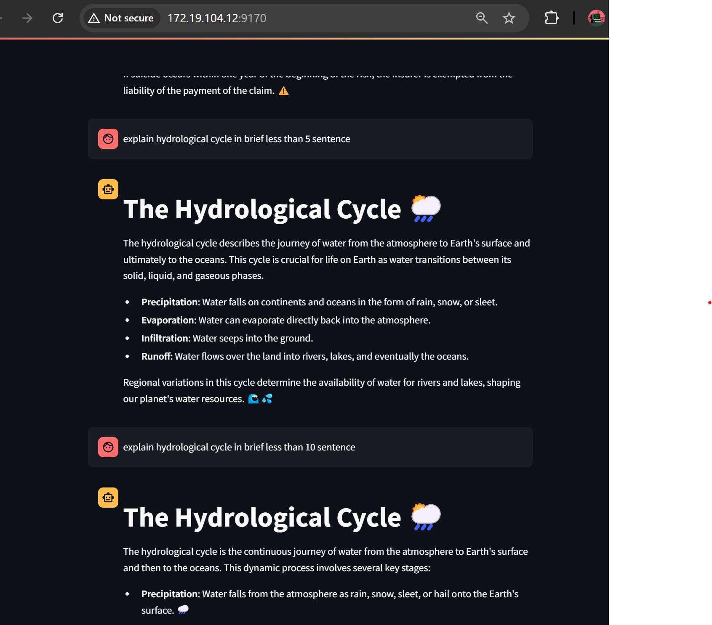
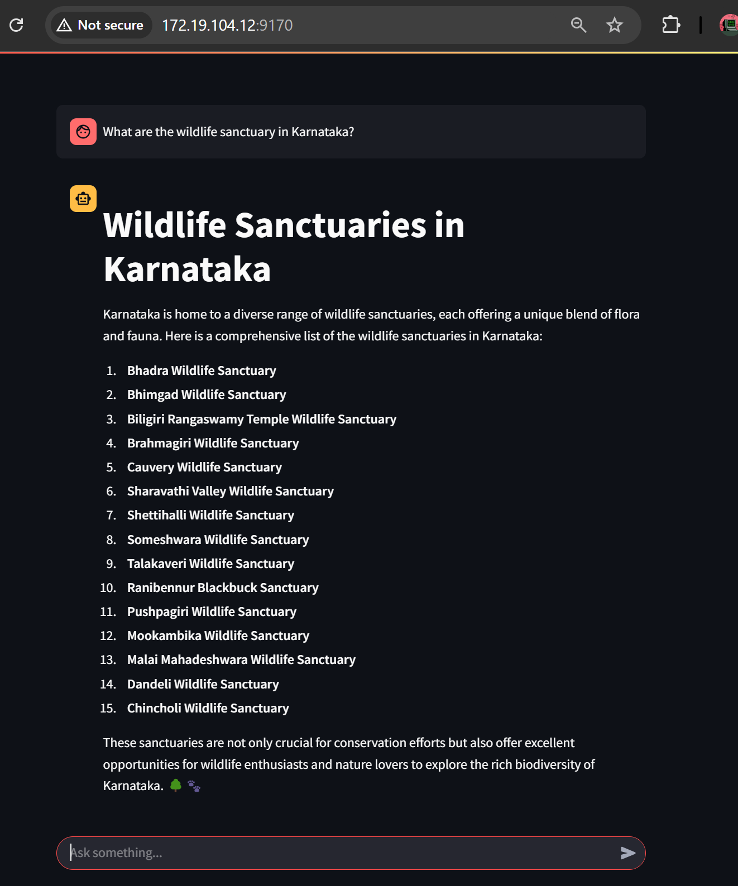

### A langchain based approach to route requests in RAG
#### Uses keyword extracted from pdfs to route requests to appropriate vectorstores


##### Create virtual env and install necessary packages
```
python -m venv .venv
source .venv/bin/activate
pip install -r requirements.txt
```
##### In this project I use chromadb as vectorstore. To start it as a service.

```
chroma run --host localhost --port 9158 --path ./local_chroma_data
```

##### To start frontend 

```
cd frontend
streamlit run app.py --server.port 9170 --server.address <IP>
```

##### To start backend

```
cd backed
uvicorn main:
app --host <IP> --port 9169 --reload
```

##### Architecture



##### Workflow below -  Refer above image

```
1. PDFs are loaded, chunked using langchain docloader.
2. Embedded are created for each chunk using embedding function  all-MiniLM-L6-v2.
3. These embeddings are stored to chromadb.
4. Text chunks are stored to chromadb.
5. Keywords are extracted from each pdf using llm.
6. These  keywords stored to keywords.json for later.
7. /chat api is called from streamlist frontend.
8. ManagerAgent takes the question. Using keyword routing technique routes to one or more PDF agents.
9. Selected Pdf Agents does similarity search on their respective collections in chromadb and Prompt + docs + question is passed to llm to get answer.
10. These answers are passed to aggregator agent that aggregates data and formats to markdown and return response to frontend.
```

##### Chat app screenshots:
###### QA 1




###### QA 2




###### QA 3




Below are some of resources I referred:
[Routing in RAG Driven Applications](https://towardsdatascience.com/routing-in-rag-driven-applications-a685460a7220/)
[Unifying LLM-powered QA Techniques with Routing Abstractions](https://medium.com/better-programming/unifying-llm-powered-qa-techniques-with-routing-abstractions-438e2499a0d0)

