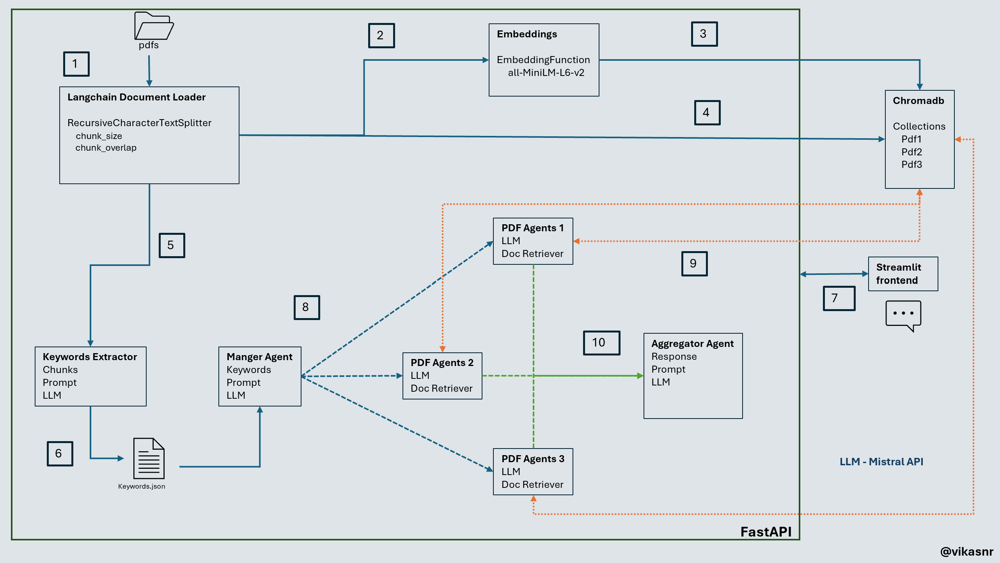

## A langchain based approach to route requests in RAG
#### Uses keyword extracted from pdfs to route requests to appropriate vectorstores


## Summary
 - [How to run?](#How-to-run)
 - [Architecture](#Architecture)
 - [Workflow](#Workflow)
 - [Chat App](#Chat-App)
 - [Options to improve](#Options-to-improve)
 - [Resources](#Resources)


### How to run?
#### Create virtual env and install necessary packages
```
python -m venv .venv
source .venv/bin/activate
pip install -r requirements.txt
```
#### I am using Mistral API here. Export MISTRAL_API_KEY

```

export MISTRAL_API_KEY = "your-key"

```
Note you could you any other supported models. Update model details in llm.py

#### In this project I use chromadb as vectorstore. To start it as a service.

```
chroma run --host localhost --port 9158 --path ./local_chroma_data
```

#### To start frontend 

```
cd frontend
streamlit run app.py --server.port 9170 --server.address <IP>
```

#### To start backend

```
cd backend
uvicorn main:
app --host <IP> --port 9169 --reload
```

### Architecture



### Workflow 
Refer above image

```
1. PDFs are loaded, chunked using langchain docloader.
2. Embedded are created for each chunk using embedding function  all-MiniLM-L6-v2.
3. These embeddings are stored to chromadb.
4. Text chunks are stored to chromadb.
5. Keywords are extracted from each pdf using llm.
6. These  keywords stored to keywords.json for later.
7. /chat api is called from streamlist frontend.
8. ManagerAgent takes the question. Using keyword routing technique routes to one or more PDF agents.
9. Selected Pdf Agents does similarity search on their respective collections in chromadb and Prompt + docs + question is passed to llm to get answer.
10. These answers are passed to aggregator agent that aggregates data and formats to markdown and return response to frontend.
```

### Chat App 
screenshots:
#### QA 1


#### QA 2


#### QA 3


### Options to improve
Based on the problem at hand and its sophistication we could try below routing techniques.
- LLM Completion Routers
- LLM Function Calling Routers
- Semantic Routers
- Zero Shot Classification Routers
- Language Classification Routers

### Resources

Below are some of resources I referred:

[Rag From Scratch: Routing](https://github.com/langchain-ai/rag-from-scratch/blob/main/rag_from_scratch_10_and_11.ipynb) \
[Unifying LLM-powered QA Techniques with Routing Abstractions](https://medium.com/better-programming/unifying-llm-powered-qa-techniques-with-routing-abstractions-438e2499a0d0) \
[Routing Langchain](https://www.youtube.com/watch?v=pfpIndq7Fi8&list=WL&index=55)\
[Routing in RAG Driven Applications](https://towardsdatascience.com/routing-in-rag-driven-applications-a685460a7220/) \
[Agent shortcomings](https://www.youtube.com/watch?v=KY8n96Erp5Q&t=592s)


